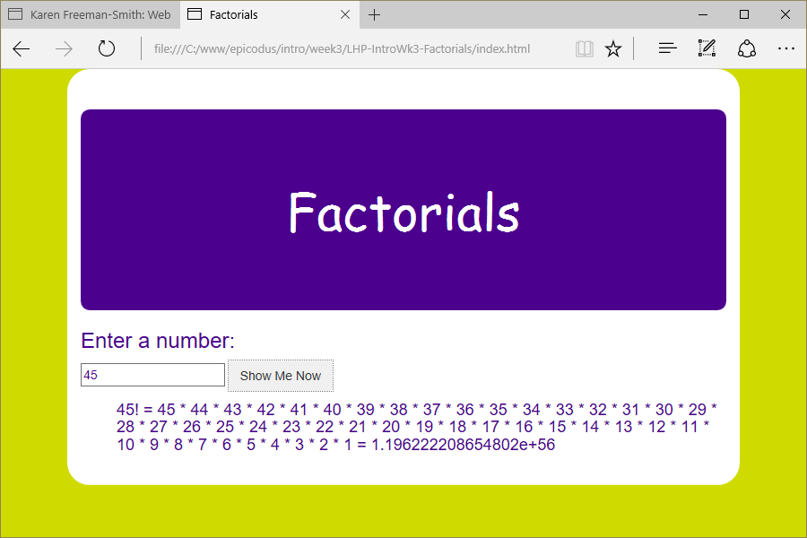

# Factorials
Version 0.0.1: April 16, 2016
by [Karen Freeman-Smith](https://karenfreemansmith.github.io)

### Technologies Used
HTML, CSS, Bootstrap, JavaScript, jQuery

## Description
*[Learn How To Program](http://learnhowtoprogram.com) Intro to Programming Week 3 Individual Project: A webpage that calculates factorials.*

## Setup/Installation
* [View on Github Pages](https://karenfreemansmith.github.io/LHP-IntroWk3-Factorials)
* _OR_
* Clone directory
* Open index.html in your favorite browser

## Support & Contact
For questions, concerns, or suggestions please email karenfreemansmith@gmail.com

## Specifications
* A factorial is an operator that multiplies a number by all of the positive integers less than that number. For example, 5! = 5 * 4 * 3 * 2 * 1 = 120.
* By definition, 0! = 1.
* Make a web page to compute factorials without recursion

## Known Issues
* None

## Legal
*Licensed under the GNU General Public License v3.0*

Copyright (c) 2016 Copyright _[Karen Freeman-Smith](https://karenfreemansmith.github.io)_ All Rights Reserved.
